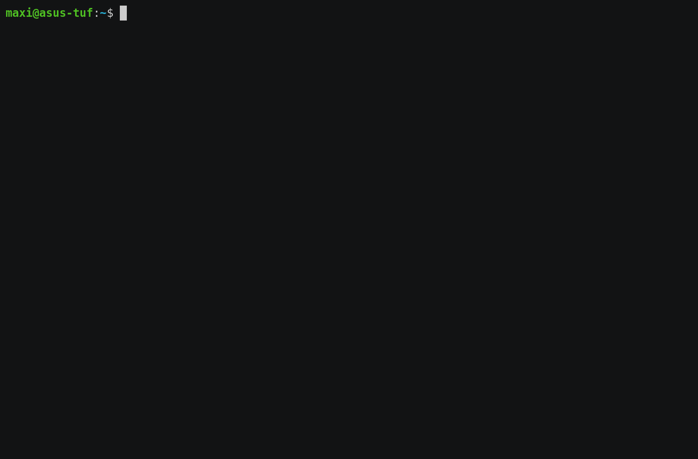

# SSM session helper

This tool helps to connect to an AWS instance using SSM sessions by querying local AWS profiles, regions available for that profile and instances running for that account in the specified region. 

A user friendly interface allows to select the options, and the connection is stablished at the end of the process.



## Requirements

This is a python script that uses PyInquirer to render the prompts, Boto3 to query AWS and configparser to parse the credentials stored locally. In addition, the [AWS CLI](https://aws.amazon.com/cli/) along with the [SSM plugin](https://docs.aws.amazon.com/systems-manager/latest/userguide/session-manager-working-with-install-plugin.html) must be installed to execute the SSM session.

## Install

1. Download binary from release
2. Move binary to a folder in your `$PATH`
3. Execute with `ssm-session` command
4. Enjoy

## How it works

The SSM command to connect to an ec2 server through the SSM service is:

```bash
aws ssm start-session --target <instance-id>
```

To specify an AWS account and region to use, generic flags can be used with the command:

```bash
aws ssm start-session --target <instance-id> --region <region> --profile <profile>
```

This tool helps querying the 3 required parameters dynamically:

1. **Credentials**: Credentials define the AWS account to use as well as ability to create the session to the ec2 instance. Credentials can be read from (in order of priority):

   1. `AWS_ACCESS_KEY_ID`, `AWS_SECRET_ACCESS_KEY` and `AWS_SESSION_TOKEN` environment variables (this approach will be used if the first two are defined, session token is required for temporary sessions).

   2. `AWS_PROFILE` will be used to determine the profile to use when reading the AWS credentials file (credentials file location is defaulted to `~/.aws/credentials`, set `AWS_CREDENTIALS_FILE` to override the location).

   3. A prompt is executed to select a profile from the configured profiles in the AWS credentials file.

2. **Region**: Region is necessary to define the location of the instance to connect to. It can be read from (in order of priority):

   1. `AWS_DEFAULT_REGION` environment variable.

   2. A prompt is executed to select a region from available regions.

3. **Instance**: `instance-id` is the last parameter to select from. Boto3 is used to query workstations running in the AWS account/region selected previously. An extra query checking which workstations are actually connected to SSM service and options that are not correctly configured in SSM are disabled. Name tag value is displayed for reference if it exists.

Once the parameters are selected (or partially read), the AWS SSM command to connect to the workstation is executed.

## Run in development

```bash
git clone https://github.com/MaximilianoAguirre/py-aws-ssm-session
cd py-aws-ssm-session

# Optionally set a virtual environment
python -m venv venv
source venv/bin/activate

# Install required packages
pip install -r py-aws-ssm-session/requirements.txt

# Run the script
python py-aws-ssm-session/ssm.py
```

## Build

```bash
git clone https://github.com/MaximilianoAguirre/py-aws-ssm-session
cd py-aws-ssm-session

# Optionally set a virtual environment
python -m venv venv
source venv/bin/activate

# Install required packages
pip install -r py-aws-ssm-session/requirements.txt

# Build the binary
pyinstaller -F ssm-session.py
```
